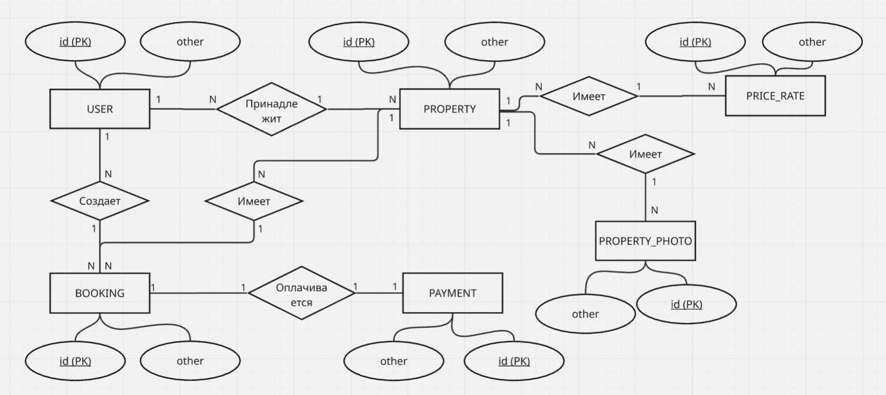
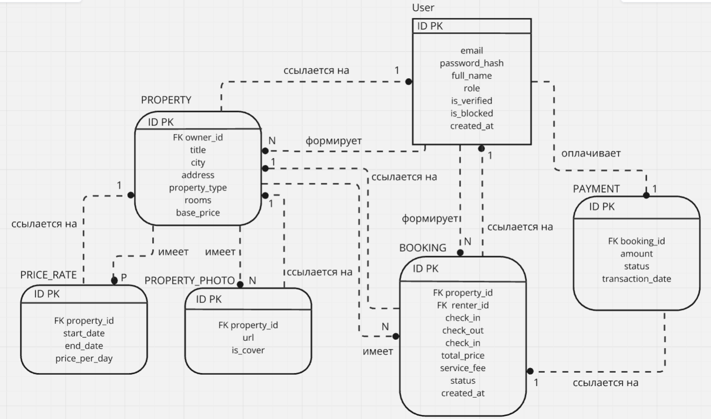

**Министерство науки и высшего образования Российской Федерации**

**ФЕДЕРАЛЬНОЕ ГОСУДАРСТВЕННОЕ АВТОНОМНОЕ ОБРАЗОВАТЕЛЬНОЕ УЧРЕЖДЕНИЕ
ВЫСШЕГО ОБРАЗОВАНИЯ**

**«Национальный исследовательский университет ИТМО» (Университет ИТМО)**

**Факультет прикладной информатики**

**Направление подготовки:** 45.03.04 Интеллектуальные системы в
гуманитарной сфере

**Образовательная программа:** Языковые модели и искусственный интеллект

**О Т Ч Е Т**

**о финальном проекте**

**Дисциплина:** Объектно-ориентированное программирование

**Тема задания:** «Сервис посуточной аренды недвижимости»

**Выполнили:** Усенко Елизавета, Панас Анастасия, Смирнова Яна,
Атрашкевич Дарья

**Проверил:** Кочубеев Николай Сергеевич

Санкт-Петербург, 2026

**СОДЕРЖАНИЕ**

[1 ПРОЕКТИРОВАНИЕ ДОМЕННОЙ ОБЛАСТИ 3](#проектирование-доменной-области)

[2 ПРОЕКТИРОВАНИЕ API И КОНТРАКТОВ 15](#проектирование-api-и-контрактов)

[3 РЕАЛИЗАЦИЯ СИСТЕМЫ 16](#реализация-системы)

[4 ДОРАБОТКА СИСТЕМЫ 17](#доработка-системы)

[ЗАКЛЮЧЕНИЕ 18](#заключение)

# **1 ПРОЕКТИРОВАНИЕ ДОМЕННОЙ ОБЛАСТИ**

Цель: Понять, что мы строим, какие сущности и правила есть в системе.

**1.1 Описание предметной области**

1.  **Бизнес-контекст**

Сервис посуточной аренды недвижимости - это цифровая платформа,
обеспечивающая взаимодействие между владельцами жилья (арендодателями) и
людьми, ищущими временное жилье (арендаторами) на короткий срок (до 1
года).

Аналоги: СУТОЧНО.РУ, Яндекс.Недвижимость, Авито Аренда.

Бизнес-модель представлена в Таблицах 1 и 2.

Таблица 1 - Business Model Canvas

| Key Partners  | Платёжные системы, Банки-партнёры, Сервисы верификации личности, Провайдеры email, Фотографы для съёмки объектов. |
|---------------|------------------------------------------------------------------------------------------------------------------|
| Key Activities | Разработка и поддержка платформы, Маркетинг и привлечение арендодателей, Модерация объявлений и верификация, Обработка платежей и возвратов. |
| Key Resources | IT-инфраструктура, Мобильные и веб-приложения, База данных объектов и пользователей, Алгоритм поиска, Команда разработчиков и дизайнеров, Бренд и репутация платформы. |
| Value Propositions | Для арендаторов: Удобный поиск жилья с фильтрами, Безопасная оплата, Гарантия соответствия жилья описанию, Широкий выбор типов жилья и ценовых категорий. Для арендодателей: Выход на большую аудиторию арендаторов, Автоматизация бронирования и оплаты, Гибкое управление. |
| Customer Relationships | Самообслуживание через приложение, Автоматические уведомления о бронированиях. |
| Customer Segments | Арендаторы: Путешественники, Студенты, Семьи. Арендодатели: Частные лица с недвижимостью. |
| Channels      | Мобильное приложение (iOS / Android), Веб-сайт платформы, Email-рассылки, Социальные сети и партнёрские блогеры. |
| Cost Structure | Разработка и поддержка IT-инфраструктуры, Зарплаты сотрудников, Комиссии платёжных систем, Маркетинг. |
| Revenue Streams | Комиссия с арендаторов: 10--12% от суммы бронирования. Комиссия с арендодателей: 3--5% от суммы выплаты. |

Таблица 2 - Value Proposition Canvas

| Продукты и услуги                 | Создание выгоды                   |
|-----------------------------------|-----------------------------------|
| Для арендаторов: Платформа поиска и бронирования жилья, Мобильное приложение и веб-сайт, Система оплаты. Для арендодателей: Личный кабинет управления, Инструменты ценообразования, Автоматические выплаты. | Для арендаторов: Экономия, Фильтры под любой запрос, Гарантия защиты платежа. Для арендодателей: Дополнительный или основной источник дохода, Автоматизация процесса, Доступ к большой аудитории. |
| Задачи клиента                    | Выгоды клиента                    |
| Найти подходящее жильё на нужные даты, Безопасно оплатить аренду. | Быстрый поиск и бронирование за несколько минут, Безопасность оплаты, Жильё, соответствующее описанию и фотографиям. |
| Обезболивающее                    | Боли клиента                      |
| Верификация пользователей - снижение риска недобросовестных сторон, Чёткая политика отмены и возвратов, Блокировка занятых дат в реальном времени, Прозрачное отображение итоговой цены со всеми сборами до оплаты. | Боли арендаторов: Страх мошенничества, Жильё не соответствует фотографиям и описанию, Двойное бронирование, Скрытые платежи, Трудность отмены и получения возврата. Боли арендодателей: Риск порчи имущества, Сложность управления несколькими объектами. |

2.  **Границы предметной области**

Входит в реализацию системы:

- Регистрация и аутентификация пользователей;
- Публикация объявлений об объектах аренды;
- Поиск и фильтрация объектов;
- Бронирование на конкретные даты с проверкой доступности;
- Обработка платежей (симуляция);
- Уведомления (по email);
- Панель администратора.

Не входит в реализацию системы:

- Долгосрочная аренда;
- Юридическое оформление договоров аренды;
- Система страхование имущества;
- Физическое управление объектами недвижимости (ремонт, уборка, транспортные услуги вне платформы);
- Кредитование / рассрочка;
- Оплата налогов;
- Уведомление Роскомнадзора, получение согласие пользователей на обработку данных;
- Система отзывов и рейтинга.

3.  **Правовое регулирование**

Ключевые правовые позиции высших судов и законодателей сформировали
следующие принципы посуточной аренды жилья в России на 2026 год:

Сдавать жилье в аренду можно без ограничений по срокам. Верховный суд РФ
в своем решении от 2025 года подчеркнул, что посуточная аренда не
является оказанием гостиничных услуг, если она не подменяет
собой работу гостиницы. Это означает, что собственник обычной квартиры
не обязан получать гостиничную лицензию и проходить обязательную
классификацию.

Закон не требует письменного согласия соседей на сдачу квартиры. Однако
собственник (и, как следствие, платформа) обязаны обеспечивать
соблюдение прав соседей: арендаторы не должны нарушать тишину, мусорить
в подъезде и создавать нагрузку на общее имущество.

Отношения между наймодателем (владельцем) и нанимателем (гостем) должны
быть оформлены договором краткосрочного найма жилого
помещения (ст. 683 ГК РФ).

Особенности краткосрочного найма: Если договор заключается на срок до
одного года, он является краткосрочным. К нему применяется упрощенный
правовой режим. Такой договор не требует государственной
регистрации в Росреестре.

Права сторон: наниматель (гость) не имеет преимущественного права на
заключение договора на новый срок (ст. 684 ГК РФ к краткосрочным
договорам не применяется). После окончания срока договора гость обязан
освободить жилье.

Обязанности сторон:

Владелец: Обязуется предоставить пригодное для проживания жилье.

Гость: Обязуется использовать помещение только для проживания, соблюдать
правила пользования и оплатить аренду.

Граница с гостиничным бизнесом:

Квартиры: Согласно разъяснениям Конституционного суда (КС) РФ, жилое
помещение в многоквартирном доме можно сдавать на срок от
одних суток, если это не создает для соседей неудобств, значительно
превышающих обычные. Квартиры не обязаны проходить классификацию, так
как это не гостиничные услуги.

Апартаменты и апарт-отели: С 2025 года апарт-отели официально приравнены
к гостиницам. Если юридическое лицо или ИП владеет комплексом
апартаментов и сдает их посуточно как единый объект, такая деятельность
считается гостиничной. Такие объекты обязаныпройти
классификацию и получить "звезды", иначе им грозит запрет на
размещение рекламы и сдачу в аренду. Для платформы это означает, что
размещать объявления от таких объектов можно только при наличии у них
действующего свидетельства о классификации.

Налоговое регулирование и ответственность:

Основной риск для владельцев жилья, который должна минимизировать
платформа - это получение нелегального дохода. Граждане, сдающие жилье,
обязаны платить налоги. Неуплата налогов (ст. 122 НК РФ) грозит штрафом
в размере 20-40% от суммы неуплаченного налога и пени за каждый день
просрочки. Незаконное предпринимательство (ст. 14.1 КоАП РФ):
Систематическое извлечение прибыли без регистрации в качестве ИП или
самозанятого влечет административный штраф.

Административная и уголовная ответственность:

Административная ответственность: Нарушение прав соседей и тишины.
Регистрация иностранных граждан.

Уголовная ответственность: Фиктивная регистрация (ст. 322.2, 322.3 УК
РФ). Незаконное предпринимательство (ст. 171 УК РФ): Осуществление
предпринимательской деятельности без регистрации, если это причинило
крупный ущерб (1,5 млн руб.) или извлечен доход в крупном размере.

Верховный суд РФ разъяснил, что не является преступлением, если
гражданин сдает квартиру, которую приобрел для личных нужд, а не
специально для бизнеса. Но систематическая сдача нескольких квартир
через платформу уже может быть расценена как предпринимательство.

Особое регулирование для платформы-агрегатора:

Как оператор персональных данных, цифровая платформа несет прямую
ответственность по Федеральному закону № 152-ФЗ. Она автоматически
становится оператором, как только начинает собирать паспортные данные,
адреса, платежную информацию и геолокацию пользователей. Это влечет за
собой обязанности: Уведомить Роскомнадзор о начале обработки данных -
Получать согласие на обработку данных - Обеспечить безопасность данных и
не передавать их третьим лицам без согласия субъекта. За нарушения
предусмотрены крупные административные штрафы, а также уголовная
ответственность для руководителей.

**1.2 Роли пользователей и их функциональные возможности**

1.  Арендатор

Функциональные возможности:

- Регистрация и управление профилем
- Поиск объектов с фильтрами
- Просмотр карточки объекта
- Создание запроса на бронирование
- Оплата через платежную систему
- Отмена бронирования

2.  Арендодатель

Функциональные возможности:

- Создание и управление карточками объектов
- Установка ценовой политики
- Просмотр и управление несколькими объектами
- Отмена бронирования

3.  Администратор

Функциональные возможности:

- Управление пользователями: просмотр, блокировка, верификация аккаунтов
- Модерация объявлений
- Управление финансовыми транзакциями: ручные возвраты, проверка платежей

4.  Гость системы

Функциональные возможности:

- Поиск объектов и просмотр результатов
- Просмотр карточки объекта (без возможности бронирования)
- Регистрация / вход в систему

**1.3 Основные сценарии использования (use cases)**

- Регистрация и верификация пользователя

Пользователь вводит email, получает код подтверждения и активирует
аккаунт. После этого открывается доступ к просмотру каталога. Для
бронирования и публикации объектов требуется верификация личности:
загрузить скан паспорта и дождаться проверки администратором.

- Публикация и управление объектом

Арендодатель добавляет жильё в систему: заполняет адрес, тип
недвижимости, количество комнат, загружает фотографии и описание. При
наличии активных бронирований изменение адреса и количества комнат
запрещено.

- Поиск и фильтрация объектов

Пользователь задаёт параметры: город, даты заезда и выезда, количество
гостей, тип жилья, диапазон цен. Объекты с занятыми датами в результатах
не отображаются.

- Бронирование объекта

Арендатор выбирает даты и создаёт заявку. Система рассчитывает итоговую
сумму, резервирует даты и отправляет пользователя на страницу оплаты.
После успешной оплаты бронирование подтверждается, обе стороны получают
email-уведомление.

- Отмена бронирования и расчет возврата

Арендатор или арендодатель инициируют отмену. Система рассчитывает сумму
возврата по политике отмены, переводит бронирование в статус «Отменено»,
освобождает даты и отправляет обеим сторонам email с информацией о
возврате.

- Модерация и администрирование платформы

Администратор через панель управления просматривает новые объявления,
вручную подтверждает или отклоняет их. При необходимости блокирует
пользователей или объекты.

**1.4 Сущности системы и доменные модели**

На основе анализа предметной области и бизнес-процессов были выделены
ключевые сущности, для каждой из которых мы определили ключевые атрибуты
и описали доменные модели и связи в Таблице 3.

Таблица 3 - Описание сущностей

| Сущность       | Назначение в предметной области | Атрибуты сущности                      | Связи          |
|----------------|---------------------------------|----------------------------------------|----------------|
| User           | Абстракция пользователя системы, содержит общие данные для всех возможных ролей | id (ID, PK), email (VARCHAR, UNIQUE), password_hash (VARCHAR), full_name (VARCHAR), role (ENUM: guest/tenant/host/admin), is_verified (BOOLEAN), is_blocked (BOOLEAN), created_at (TIMESTAMP) | Один User владеет многими Property (1:N). Один User создаёт много Booking (1:N). |
| Property       | Объект недвижимости, который сдаётся в аренду | id (ID, PK), owner_id (UUID, FK->User), title (VARCHAR), city (VARCHAR), address (VARCHAR), property_type (ENUM), rooms (SMALLINT), base_price (DECIMAL), status (ENUM: draft/active/inactive/blocked), description (TEXT), created_at (TIMESTAMP) | Принадлежит одному User (N:1). Имеет много Booking (1:N). Имеет много PriceRate (1:N). Имеет много Photo (1:N). |
| Booking        | Факт резервирования жилья на конкретные даты. | id (ID, PK), property_id (UUID, FK->Property), renter_id (ID, FK->User), check_in (DATE), check_out (DATE), total_price (DECIMAL), service_fee (DECIMAL), status (ENUM: pending/confirmed/completed/cancelled), comment (TEXT), created_at (TIMESTAMP) | К одному Booking привязан один Payment (1:1). |
| Payment        | Финансовая транзакция по бронированию. | id (ID, PK), booking_id (ID, FK->Booking), amount (DECIMAL), status (ENUM: pending/succeeded/failed/refunded), transaction_date (TIMESTAMP) | Привязан к одному Booking (1:1). Подтверждённый платёж меняет статус брони. |
| Price_Rate     | Сущность, отвечающая за ценообразование | id (ID, PK), property_id (ID, FK->Property), start_date (DATE), end_date (DATE), price_per_day (DECIMAL) | Принадлежит одному Property (N:1). Применяется при расчёте стоимости бронирования. |
| Property_Photo | Фотография объекта. | id (ID, PK), property_id (UUID, FK->Property), url (TEXT), is_cover (BOOLEAN) | Принадлежит одному Property (N:1) |

**1.5 Бизнес-правила системы**

Правила регистрации и верификации пользователей:

1.  Email уникален;
2.  Подтверждение email обязательно;
3.  Верификация для полного доступа к возможностям платформы;
4.  Заблокированный администратором пользователь лишается доступа ко всем операциям платформы.
5.  Один пользователь может иметь одновременно роли арендатора и арендодателя.

Правила управления объектами аренды:

1.  Только верифицированный пользователь может публиковать объект;
2.  Обязательные поля объявления;
3.  Запрет на изменения ключевых параметров при активных бронированиях (адрес, количество комнат, тип недвижимости)
4.  Статусы объекта: draft - черновик (не виден); active - опубликован; inactive - скрыт владельцем; blocked - заблокирован администратором.
5.  Нельзя удалить объект с активными бронированиями
6.  Объект обязан содержать: город, адрес, фотографии, описание, базовую стоимость, количество комнат.
7.  Один объект может принадлежать только одному владельцу.

Правила ценообразования:

1.  Цена всегда больше нуля;
2.  Есть цена по умолчанию (base_price), которая действует когда нет никакого специального тарифа. Арендодатель может установить Price_Rate на конкретный период.
3.  Итоговая стоимость фиксируется в момент бронирования.

Правила бронирования:

1.  Нельзя бронировать собственный объект;
2.  Дата выезда позже даты заезда;
3.  Запрет на пересечение дат;
4.  Только верифицированный арендатор;
5.  Минимальный срок аренды - 1 сутки.

Правила оплаты:

1.  Одно бронирование - один платёж;
2.  Статус оплаты меняет статус бронирования;
3.  Комиссия платформы;
4.  Бронирование получает статусы: pending/confirmed/completed/cancelled.

Правила отмены бронирования и возврата средств:

1.  Отмену может инициировать любая из сторон;
2.  После отмены даты освобождаются;
3.  При отмене бронирования любой из сторон арендатору возвращается полная стоимость;
4.  Завершенное бронирование нельзя отменить.

Правила email-уведомлений представлены в таблице 4.

Таблица 4 - Правила email-уведомлений

| Событие         | Кому отправляется       | Содержание уведомления |
|-----------------|-------------------------|------------------------|
| Регистрация     | Пользователю            | Код подтверждения email |
| Верификация одобрена | Пользователю            | Уведомление о том, что верификация пройдена |
| Бронирование создано | Арендодателю            | Информация о новом запросе на бронирование |
| Оплата прошла   | Обоим сторонам          | Подтверждение бронирования, даты, сумма |
| Бронирование отменено | Обоим сторонам          | Информация об отмене и сумме возврата |

**1.6 Назначение базы данных**

Для хранения данных системы используется реляционная СУБД PostgreSQL.
Все данные хранятся в единой базе rental_db. Таблицы: users, properties,
property_photos, price_rates, bookings, payments.

**1.7 Диаграммы**

ER-диаграмма в нотации Чена представлена на рисунке 1. Атрибуты
сущностей урезаны, чтобы не перегружать диаграмму.

Рис. 1 - ER-диаграмма в нотации Чена

IDEF1X-модель представлена на рисунке 2.

Рис. 2 - IDEF1X-модель

**1.8 Заключение по этапу 1**

В рамках первого этапа проработана доменная область сервиса посуточной
аренды. Определены бизнес-контекст и границы системы, описаны роли
пользователей, выделены сущности с атрибутами и связями, сформулированы
бизнес-правила.

# **2 ПРОЕКТИРОВАНИЕ API И КОНТРАКТОВ**

Цель: Определить, как сервисы взаимодействуют друг с другом и с
клиентами.

**2.1 Архитектура системы**

Система будет реализована как единый монолитный REST API на C# с одной
базой данных PostgreSQL. Программа работает по стандартной схеме: клиент
отправляет HTTP-запросы на сервер, передавая данные в текстовом формате
JSON. Сервер принимает эти запросы, проверяет выполнение всех
бизнес-правил системы и сохраняет нужные изменения в общую базу данных
rental_db.

**2.2 API аутентификации и пользователей**

Таблица 5 - API аутентификации и пользователей

| Метод    | URL                               | Доступ        | Назначение операции |
|----------|-----------------------------------|---------------|----------------------|
| POST     | /api/v1/auth/register             | Guest         | Регистрация нового аккаунта в системе |
| POST     | /api/v1/auth/login                | Guest         | Вход в систему (проверка пароля и выдача токена доступа) |
| POST     | /api/v1/users/verify-email        | Guest         | Подтверждение профиля кодом, который пришел на email |
| GET      | /api/v1/users/profile             | Authorized    | Получение данных для экрана личного кабинета |
| PUT      | /api/v1/users/profile             | Authorized    | Изменение личных данных (ФИО, email) |
| POST     | /api/v1/users/verify-identity     | Tenant/Host   | Загрузка паспортных данных для проверки администратором |
| GET      | /api/v1/admin/users/pending       | Admin         | Просмотр списка пользователей, которые ждут верификацию |
| PUT      | /api/v1/admin/users/{id}/verify   | Admin         | Подтверждение или отклонение верификации пользователя |
| PUT      | /api/v1/admin/users/{id}/block    | Admin         | Блокировка учетной записи пользователя за нарушения |

**2.3 API объектов аренды**

Таблица 6 - API объектов аренды

| Метод      | URL                                     | Доступ       | Назначение операции |
|------------|-----------------------------------------|--------------|----------------------|
| GET        | /api/v1/properties                      | Все роли     | Поиск жилья с фильтрами по городу, датам, цене и комнатам |
| GET        | /api/v1/properties/{id}                 | Все роли     | Открытие подробной карточки конкретного объекта недвижимости |
| GET        | /api/v1/properties/my                   | Host         | Просмотр арендодателем списка всех своих объявлений |
| POST       | /api/v1/properties                      | Verified Host| Создание нового объявления |
| PUT        | /api/v1/properties/{id}                 | Host         | Редактирование описания и условий (если нет активных броней) |
| PUT        | /api/v1/properties/{id}/status          | Host         | Изменение статуса объекта |
| POST       | /api/v1/properties/{id}/photos          | Host         | Загрузка фото объекта с указанием главного фото (is_cover) |
| DELETE     | /api/v1/properties/{id}/photos/{p_id}   | Host         | Удаление фотографии из галереи объекта |
| POST       | /api/v1/properties/{id}/rates           | Host         | Установка Price_Rate |
| DELETE     | /api/v1/properties/{id}/rates/{r_id}    | Host         | Удаление настроенного Price_Rate |

**2.4 API бронирований**

Таблица 7 - API бронирований

| Метод     | URL                                | Доступ        | Назначение операции |
|-----------|------------------------------------|---------------|----------------------|
| POST      | /api/v1/bookings                   | Verified Tenant | Создание заявки на бронирование объекта на выбранные дни |
| GET       | /api/v1/bookings/{id}              | Стороны сделки | Получение детальной информации о конкретной брони и счете |
| GET       | /api/v1/bookings/trips             | Tenant        | Просмотр арендатором списка своих поездок и заявок |
| GET       | /api/v1/bookings/orders            | Host          | Просмотр владельцем запросов от гостей на его жилье |
| POST      | /api/v1/bookings/{id}/cancel       | Tenant/Host   | Отмена бронирования и перевод его в статус cancelled |
| GET       | /api/v1/properties/{id}/calendar   | Все роли      | Получение календаря занятых дат, чтобы скрыть их при поиске |

**2.5 API платежей**

Так как реальная интеграция с банковскими картами вынесена за границы
проекта, этот модуль симулирует проведение оплаты на стороне кода. При
успешном получении запроса система меняет статус бронирования на
«Оплачено» (confirmed) и запускает отправку Email-уведомлений, которые
были описаны в Таблице 4.

Таблица 8 - API платежей

| Метод     | URL                            | Доступ            | Назначение операции |
|-----------|--------------------------------|-------------------|----------------------|
| POST      | /api/v1/payments/process       | Tenant            | Симуляция оплаты созданного бронирования |
| GET       | /api/v1/payments/{id}          | Tenant/Admin      | Просмотр информации о совершенном платеже (чек) |
| POST      | /api/v1/payments/{id}/refund   | System/Admin      | Оформление возврата денег на карту при отмене брони |

**2.6 Обработка ошибок**

Чтобы программа работала стабильно и не аварийно, все ошибки
обрабатываются сервером. Если пользователь передал неверные данные или
нарушил правила системы, сервер возвращает понятный код ответа HTTP и
текст с описанием проблемы:

1.  400 Bad Request: Ошибка в заполнении данных (например, пропущено
    обязательное поле, неверный email или дата выезда указана раньше
    даты заезда);
2.  401 Unauthorized: Пользователь не залогинился в системе или срок
    действия его сессии истек;
3.  403 Forbidden: Попытка совершить действие, запрещенное ролью
    (например, неверифицированный пользователь пытается забронировать
    квартиру, или один владелец пытается отредактировать объект
    другого);
4.  404 Not Found: Квартира, пользователь или бронь с таким ID не
    найдены в базе данных;
5.  409 Conflict: Нарушение логики системы.

**2.7 Примеры контрактов**

Ниже приведены примеры для трёх ключевых операций системы: регистрация,
создание бронирования и оплата.

Контракт 1 - Регистрация пользователя

| Запрос  | { "email": "user@example.com", "password": "Passw0rd!", "full_name": "Иван Иванов" } |
|---------|--------------------------------------------------------------------------------------|
| Ответ   | { "id": "a1b2c3d4-...", "email": "user@example.com", "full_name": "Иван Иванов", "is_verified": false } |
| Ошибки  | 400 - пустые поля или неверный формат email, 409 - пользователь с таким email уже существует |

Контракт 2 - Создание бронирования

| Запрос  | { "property_id": "x9y8z7w6-...", "check_in": "2026-07-10", "check_out": "2026-07-15" } |
|---------|----------------------------------------------------------------------------------------|
| Ответ   | { "id": "b2c3d4e5-...", "status": "pending", "check_in": "2026-07-10", "check_out": "2026-07-15", "total_price": 17500.00, "service_fee": 1925.00, "created_at": "2026-06-01T10:00:00Z" } |
| Ошибки  | 400 - дата выезда раньше даты заезда, 403 - пользователь не верифицирован, 409 - выбранные даты уже заняты |

Контракт 3 - Оплата бронирования

| Запрос  | { "booking_id": "b2c3d4e5-..." } |
|---------|----------------------------------|
| Ответ   | { "payment_id": "c3d4e5f6-...", "booking_id": "b2c3d4e5-...", "amount": 17500.00, "status": "completed", "transaction_date": "2026-06-01T10:05:00Z" } |
| Ошибки  | 400 - бронирование не в статусе pending, 404 - бронирование не найдено, 409 - оплата для этого бронирования уже существует |

**2.8 Заключение по этапу 2**

В рамках второго этапа проработаны все основные запросы, которые
понадобятся для работы сервиса. Составлен подробный список из
эндпоинтов, API закрывает шаги: от обычной регистрации и верификации
пользователей до управления объектами, а также оформление броней и
симуляцию оплаты. Был выбран текстовый формат JSON для обмена данными и
стандартные коды ошибок HTTP.

# **3 РЕАЛИЗАЦИЯ СИСТЕМЫ**

Цель: Собрать рабочий прототип.

Ссылка на репозиторий GitHub:
[https://github.com/Anr1st/final_project](https://github.com/Anr1st/final_project)

**3.1 Стек технологий**

- C# / ASP.NET Core - основной ЯП и фреймворк для REST API;
- Entity Framework Core - работа с базой данных из C#-кода;
- PostgreSQL - единая реляционная СУБД (rental_db);
- JWT - аутентификация и авторизация пользователей;
- Swagger / Swashbuckle - автогенерируемая документация и тестирование API.

**3.2 Структура проекта**

Проект реализован как единый монолит. Каждый слой отвечает за свою зону
ответственности. Структура представлена в таблице 9.

Таблица 9 - Структура папок проекта

| Слой             | Зона ответственности |
|------------------|----------------------|
| Controllers      | Принимают HTTP-запросы, проверяют авторизацию, вызывают сервисы, возвращают ответ клиенту. |
| Services         | Вся бизнес-логика: проверка правил, расчёт стоимости, обращение к базе через AppDbContext. |
| Models           | Классы сущностей C#, соответствующие таблицам базы данных (User, Property, Booking, Payment, PriceRate, PropertyPhoto). |
| Mocks            | Заглушки трёх внешних сервисов: платёжный шлюз, email-уведомления, верификация личности. |

**3.3 Схемы данных (DTO)**

**3.4 Модели данных**

**3.5 Моки внешних сервисов**

Три внешние зависимости заменены заглушками, поскольку реальная
интеграция с ними выходит за границы учебного проекта. Каждый мок
реализует тот же интерфейс, что и реальный сервис, что позволит при
необходимости заменить его без изменения остального кода.

**3.6 Аутентификация**

**3.7 Обработка ошибок**

**3.8 Документация API (Swagger)**

**3.9 Sequence-диаграммы**

**3.10 Заключение по этапу 3**

В рамках третьего этапа реализован рабочий прототип сервиса посуточной
аренды недвижимости. Система построена как монолит на C# / ASP.NET Core
с единой базой данных PostgreSQL. Код разделён на четыре слоя: Models,
Controllers, Services, Mocks. Реализованы все эндпоинты из этапа 2,
схемы DTO, аутентификация через JWT и документация через Swagger. Три
внешние зависимости, платёжный шлюз, email-сервис и верификация
личности, заменены моками.

# **4 ДОРАБОТКА СИСТЕМЫ**

Цель: Сделать рабочий прототип сценария, должны получить рабочее
приложение с mockами внешних зависимостей.

# **ЗАКЛЮЧЕНИЕ**
